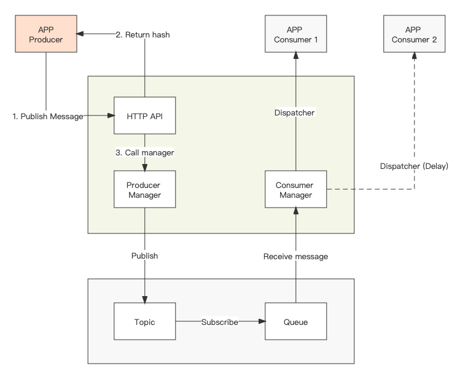

# GMD

Golang Message Dispatcher

```shell
cd your_path && \
go build -o gmd && \
./gmd start
```



----

### Supported middleware

1. AliyunMNS
2. RabbitMQ
3. RocketMQ

----

### Guide

1. [HTTP API](./docs/api)
2. Utility
    1. Export Markdown documents. `go run main.go docs`
    2. Export Postman collection file. `go run main.go docs -a postman`
    3. Use docker container


